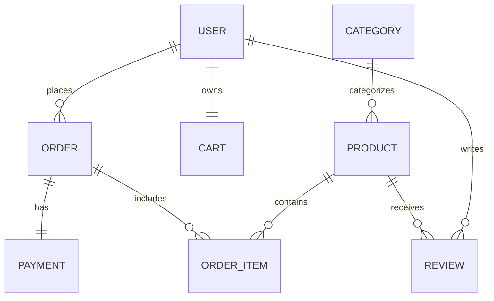
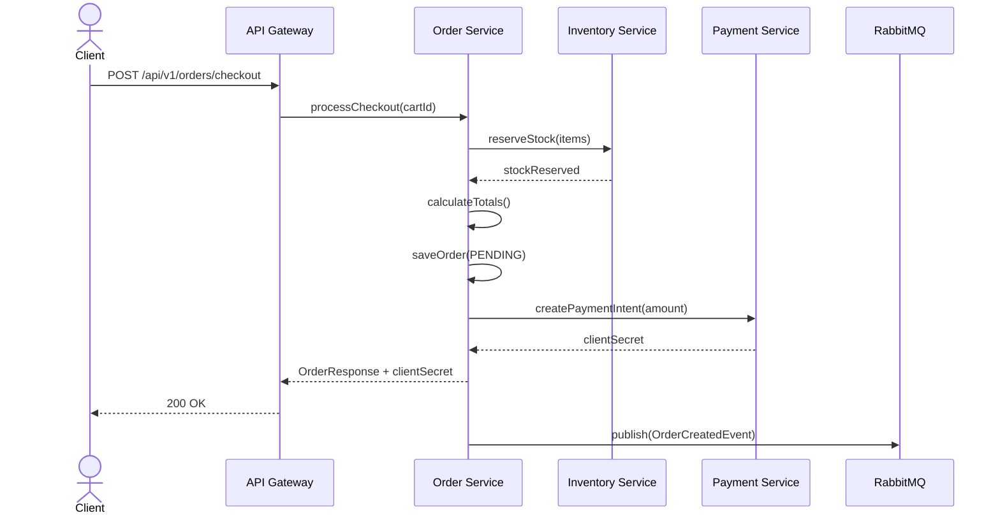
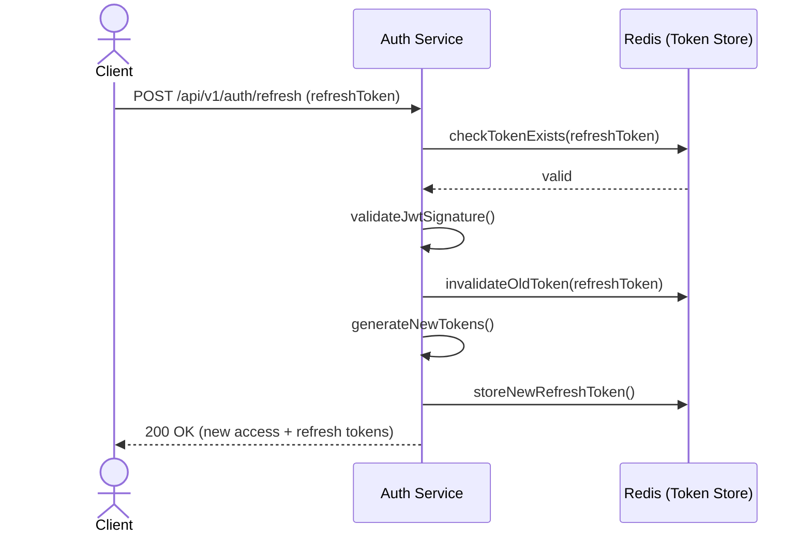
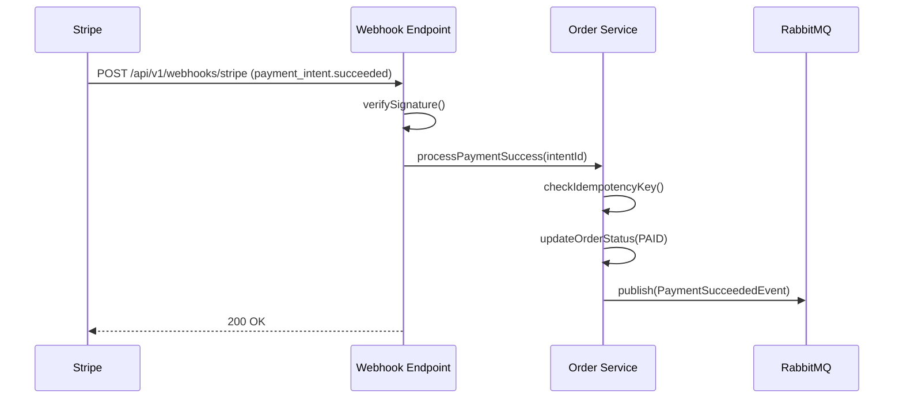

# Enterprise E-Commerce Backend API


A portfolio-grade, production-ready E-Commerce REST API built with Java 21 and Spring Boot 3.x. This project demonstrates enterprise backend patterns including Layered Architecture, Package-by-Feature, asynchronous event-driven communication, and strict concurrency control.

## 🏗 Architecture Overview

The application follows a **Package-by-Feature** structure, ensuring high cohesion and low coupling. Business logic is strictly encapsulated within services, and controllers act only as thin HTTP adapters.

### Tech Stack
*   **Core**: Java 21, Spring Boot 3.3.x, Maven
*   **Data & Caching**: PostgreSQL (Relational), Redis (Caching & Session), Flyway (Migrations)
*   **Messaging**: RabbitMQ (Async Events)
*   **Storage**: MinIO (S3-compatible Object Storage)
*   **Security**: Spring Security, JWT (Access + Refresh Tokens), BCrypt
*   **Integrations**: Stripe (Payments)
*   **Testing**: JUnit 5, Mockito, Testcontainers, AssertJ
*   **Utilities**: Lombok, MapStruct, Springdoc OpenAPI (Swagger)

---

## 🚀 Getting Started

### Prerequisites
*   [Docker](https://www.docker.com/) & Docker Compose
*   [Java 21](https://adoptium.net/)
*   Maven (or use the included `./mvnw` wrapper)

### 1. Start Infrastructure
Spin up PostgreSQL, Redis, RabbitMQ, and MinIO using Docker Compose:
```bash
docker-compose up -d
```

### 2. Environment Variables
Copy the example environment file:
```bash
cp .env.example .env
```

### 3. Run the Application
```bash
./mvnw spring-boot:run
```
The API will be available at `http://localhost:8080`.

### 4. API Documentation
Interactive Swagger UI is available at:
👉 **`http://localhost:8080/swagger-ui.html`**

---

## 📊 System Diagrams

### Entity Relationship (ER) Diagram


### Checkout Sequence
Demonstrates the orchestration of a checkout process, including stock reservation and payment intent creation.


### JWT Refresh Token Rotation
Demonstrates secure token rotation with reuse detection backed by Redis.


### Stripe Webhook Reconciliation
Demonstrates idempotent, replay-safe webhook handling.


---

## 📁 Folder Structure
```text
src/main/java/com/example/ecommerce/
├── common/         # API envelopes, global exceptions, base entities, MDC tracing
├── security/       # JWT filters, SecurityFilterChain, CORS/CSRF
├── auth/           # Login, registration, token rotation
├── user/           # User profiles, addresses, RBAC
├── product/        # Catalog, JPA Specifications (search/filter)
├── category/       # Nested category trees
├── inventory/      # Stock tracking, pessimistic locking
├── cart/           # Shopping cart, Redis session storage
├── order/          # Checkout orchestration, state machine
├── payment/        # Stripe integration, webhooks
└── notification/   # Async email consumers
```

---

## 🧪 Testing Strategy
*   **Unit Tests**: Fast, isolated tests using Mockito for business logic.
*   **Integration Tests**: `@SpringBootTest` combined with **Testcontainers**. Real PostgreSQL, Redis, and RabbitMQ containers are spun up to ensure queries, caching, and message routing work exactly as they will in production.
*   **Run Tests**: `./mvnw clean verify`

---

## 🔮 Future Improvements
*   **Rate Limiting**: Implement Redis-backed rate limiting (Token Bucket algorithm) per IP/User to prevent brute-force attacks.
*   **Elasticsearch**: Offload complex product catalog search queries from PostgreSQL to Elasticsearch for better performance and fuzzy matching.
*   **Transactional Outbox Pattern**: Guarantee at-least-once delivery of RabbitMQ messages by writing events to the database in the same transaction as business entities, then polling them.